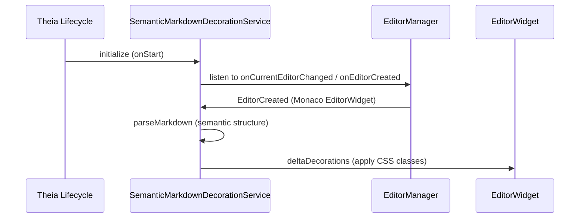

# Отрисовка декораций семантического Markdown в Monaco Editor

В пакете `@ai-focused-editor/manuscript-workspace` реализована динамическая отрисовка декораций (decorations) и разметки семантического Markdown прямо поверх текстового контента в редакторе Monaco Editor.



## Ключевые компоненты API `@theia/editor`

Для управления декорациями в коде используется `SemanticMarkdownDecorationService`, который реализует `FrontendApplicationContribution`:

### 1. `EditorManager`
Служит для отслеживания текущего активного редактора и перехвата событий создания новых окон редактирования:
- `onCurrentEditorChanged`
- `onEditorCreated`

### 2. `EditorDecoration` и `deltaDecorations`
Декорации в Monaco Editor представляют собой стилизованные оверлеи (CSS-классы), накладываемые на определенные диапазоны строк/колонок (`Range`). При изменении текста декорации пересчитываются и обновляются через метод:
```typescript
const newDecorations: EditorDecoration[] = ranges.map(range => ({
    range,
    options: {
        className: 'afe-semantic-tag-highlight',
        hoverMessage: { value: 'Семантический тэг: понятие' }
    }
}));

editor.deltaDecorations(oldDecorationIds, newDecorations);
```

## Архитектурные особенности:
- **Разделение среды выполнения**: Декорирование происходит исключительно во Frontend процессе (`browser`), так как требует прямого взаимодействия с Monaco DOM/API.
- **Производительность**: Пересчет декораций оптимизирован с помощью дебаунсинга (debouncing) на события изменения текстовой модели во избежание фризов UI при быстром наборе текста.

## Связанные концепции

- [[ai-editor-theia-integration]] — Общая карта интеграции Theia в редакторе
- [[widgets-and-views]] — Кастомные панели и виджеты
