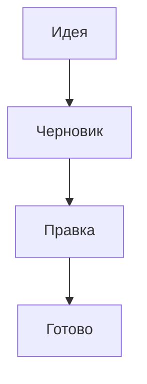

Одно и то же имя всплывает у вас в десятке глав, и однажды вы перестаёте помнить,
где именно. Пометка в тексте — способ сказать редактору: вот здесь речь о том
самом человеке. Выглядит она так:

`Утром [[char:krishna|Кришна]] вернулся во [[location:vrindavan|Вриндаван]].`

Внутри двойных скобок три вещи: вид (`char` — персонаж, `term` — термин,
`location` — место, `artifact` — предмет), опознаватель карточки и подпись. Читателю
достанется только подпись — «Кришна». Всё остальное живёт в файле главы и нужно
редактору, чтобы связать упоминание с карточкой.

Если в книге заведены и собственные виды сущностей — не только эти четыре, — вид
может быть словом на любом языке: для типа с ключом `tagKind: персонаж` в
`entities/types.yaml` пометка `[[персонаж:ivan|Иван]]` — рабочая запись, редактор
поймёт её так же, лишь бы слово перед двоеточием было строчным.

Взамен вы получаете: пометка подсвечена прямо в тексте, при наведении всплывает
карточка целиком — и в этом же окошке есть «Открыть карточку», чтобы уйти на
правку, — а в структуре документа под каждым заголовком видно, кто в этом куске
появляется.

## Пометить кусок текста

Оба способа лежат в контекстном меню редактора — выделите слово и нажмите правую
кнопку; то же самое есть в строке меню, в «Рукопись» → «Семантический Markdown».
Все пункты там начинаются с приставки «AI Focused Editor:», дальше идёт само
название команды.

**«Обернуть выделение в тег персонажа»** (и три такие же команды для термина,
места и предмета) превращает выделенное в пометку прямо на месте, придумав
опознаватель из самой подписи: кириллица переводится в латиницу, «Кришна»
становится `krishna`. Карточку эта команда не создаёт — пометка просто повиснет в
тексте и никуда не поведёт, пока карточки нет.

**«Сохранить выделение как нового персонажа…»** (и её три двойника) делает
обратное и большее: спрашивает имя — подставляя первые слова выделения, — заводит
файл в папке `entities`, кладёт туда выделенный кусок как краткое описание
(длинное обрежется на 500 символах), открывает карточку в форме и заодно
подставляет пометку в текст. Если имя уже занято, к файлу добавляется номер, и
пометка ведёт именно на новый файл — они не разъезжаются.

Про краткое описание есть и нижняя граница: если выделение короче двенадцати
знаков или после чистки пробелов совпадает с введённым именем, поле описания в
карточку не запишется вовсе. То есть самый частый случай — выделили одно имя
«Кришна» и нажали «Сохранить как…» — даёт карточку с пустым описанием; заполнять
его придётся в форме.

Оборачивать можно только то, что уместилось в одну строку: на выделении из двух
абзацев команда честно откажется, как и на уже обёрнутом куске. «Сохранить как…»
примет любое выделение, но пометку подставит, только если оно однострочное и не
длиннее 120 символов, — абзац целиком в подпись не годится, и текст останется как
был. Символы `|`, `[`, `]` из подписи вычищаются в обоих случаях: они спорят с
синтаксисом самой пометки.

Пока пишете, работает и подсказка: наберите `[[` — редактор предложит уже
заведённые карточки (вид, опознаватель, краткое описание), а следом за ними —
заготовки вида `char:…`, `term:…` и остальных. Заготовки в списке всегда, а не
только когда карточек нет: они держат синтаксис под рукой. Начали набирать вид —
список сузится до подходящих. Выбранная подстановка сразу оставляет подпись
выделенной, чтобы её можно было переписать под падеж.

## Ссылки на заметки (как в Obsidian)

Те же двойные скобки умеют не только помечать сущность. Напишите внутри просто
имя файла — `[[Замысел романа]]` — и это станет ссылкой на соседнюю главу или
заметку, ровно как в Obsidian. Дописывать `.md` не нужно, регистр не важен:
`[[замысел романа]]` найдёт тот же файл.

Ищет редактор по всей книге — по всем `.md`, где бы они ни лежали, а не только в
текущей папке. Нашёл ровно один файл с таким именем — ссылка ведёт на него.
Хотите указать точнее — впишите путь через косую черту: `[[черновики/Замысел
романа]]` возьмёт файл именно из этой папки, считая от корня книги.

**Сначала — карточки.** Если имя в скобках совпадает с опознавателем карточки,
редактор сперва пробует карточку: так `[[sharan-108]]` по-прежнему ведёт на
сущность, а не ищет одноимённый файл. На заметку ссылка срабатывает, только когда
сущности с таким именем нет. Полный порядок такой: карточка → файл по имени →
файл по заголовку → «ничего не нашлось».

**Заголовок вместо имени файла.** Если файла с нужным именем нет, редактор
заглянет внутрь заметок и поищет по заголовку — сначала по полю `title` в
свойствах главы, а нет его — по первому заголовку `#` в тексте, тоже без учёта
регистра. Этого в Obsidian нет: там ссылка ищет только по имени файла. В студии
так удобнее сослаться на главу по её человеческому названию, не запоминая имя
файла.

**Переход и якорь.** Открывается заметка по Cmd+клику (в Windows и Linux —
Ctrl+клик), как и всё остальное; без зажатой клавиши это просто текст. Можно
прыгнуть сразу к нужному заголовку: `[[Замысел романа#Финал]]` откроет файл и
прокрутит к «Финалу», кириллица в заголовке работает. Только якорь здесь
считается так же, как в собранной книге и в межглавных ссылках
`(glava-02.md#...)`, — по «причёсанному» виду заголовка (латиница, дефисы), а не
по сырому тексту, как в Obsidian. Это сознательно: один и тот же якорь должен
работать и в редакторе, и в готовых HTML или EPUB.

**Своя подпись.** Как и у пометки, после `|` можно дать подпись: `[[Замысел
романа|к первому наброску]]`. В тексте останется подпись, а ведёт ссылка всё
туда же.

**Подсказка по `[[`.** Та же подсказка, что предлагает карточки, показывает
теперь и файлы заметок. Пока имя уникально, подставится короткое `[[Имя]]`; а
если такое имя носят несколько файлов — подставится путь `[[папка/Имя]]`, чтобы
ссылка вела именно туда, куда вы думаете (снова как в Obsidian).

**Когда имён-двойников несколько.** Одно и то же имя могут носить файлы в разных
папках. Тогда редактор берёт ближайший к текущей главе по дереву папок. А если
они на равном расстоянии — берёт первый по алфавиту и при наведении честно
предупреждает: «неоднозначная ссылка, уточните путь». По Cmd+клику же по такой
равно-неоднозначной ссылке редактор не гадает вовсе, а показывает список файлов
на выбор. Надёжнее, конечно, с самого начала вписать путь.

**Ссылка в никуда.** Имя, за которым пока нет файла, подчёркивается пунктиром —
отличить его от рабочей ссылки можно и не по цвету. Cmd+клик по такой ссылке
создаст файл, а где — решает сама ссылка: `[[черновики/Новая глава]]` заведёт его
в «черновиках», а голое `[[Новая глава]]` — рядом с текущей главой. Внутри будет
одна строка, заголовок `# Новая глава`, без блока свойств; остальное за вами.

В предпросмотре главы такие ссылки тоже кликабельны — как и пометки в панели
свойств, здесь достаточно простого щелчка, без Cmd.

Ну и о чём честно предупредить:

- **Подсветка смотрит только на имя файла.** Ссылку, которая находится лишь по
  заголовку, редактор всё равно подчеркнёт пунктиром, как ненайденную:
  заглядывать в каждый файл на каждое нажатие клавиши слишком дорого. Но Cmd+клик
  по ней сработает правильно — сперва он ещё раз поищет по заголовку и, если
  нашёл, откроет файл, а не создаст новый.
- **Имя с двоеточием читается как пометка.** `[[замысел: черновик]]` редактор
  поймёт не как заметку, а как пометку сущности (строчное слово перед `:` — это
  вид) и, скорее всего, сочтёт сломанной. Если в имени файла правда есть
  двоеточие — а на macOS и Windows его там и быть не может, — сошлитесь через
  путь с косой чертой. `[[Замысел: черновик]]` с большой буквы или с пробелом
  перед `:` остаётся обычной заметкой.
- **Псевдонимы из свойств не в счёт.** Если в свойствах заметки перечислены
  `aliases`, как это умеет Obsidian, для поиска редактор их не использует: он
  ищет по имени файла и заголовку, но не по списку псевдонимов.
- **Ссылки на блок (`#^…`) не поддержаны.** Прыгнуть можно к заголовку, но не к
  отдельному помеченному абзацу.

## Сноски

«Вставить сноску» ставит `[^1]` там, где стоит курсор, добавляет строку для текста
сноски следом за другими сносками — или в конец главы, если их ещё нет, — и
переносит курсор туда же: остаётся дописать саму сноску. Номер берётся следующий
свободный — с уже занятыми он не столкнётся. А вот перенумерации не происходит:
строка определения всегда дописывается последней, а и предпросмотр, и собранная
книга нумеруют сноски по порядку определений. Поэтому сноска, вставленная в
середину главы, идёт по тексту как ¹ … ³ … ², тогда как список «Notes» внизу
выстроен ровно: 1, 2, 3. Нужен порядок по чтению — переставьте строки определений
в конце главы руками.

Номер в тексте и сама сноска связаны в обе стороны, но переход — по Cmd+клику (в
Windows и Linux — Ctrl+клик): так вы прыгнете от `[^1]` к сноске, а от сноски — к
первому упоминанию. Без зажатой клавиши это просто текст.

Читать редактор умеет и словесные метки — `[^откуда]` он поймёт, — но сам
расставляет только цифры.

## Посмотреть, что получилось

Предпросмотр открывается кнопкой «Открыть предпросмотр Markdown» на вкладке
любого `.md`-файла и показывает, во что превратилась ваша разметка: списки-галочки
становятся значками ☐ и ☑, записанное между знаками доллара — набранной формулой,
картинки подставляются из папки книги, а сноски уезжают в раздел «Notes» в конце.
Переписывается он на каждое нажатие клавиши, сам по себе, и умеет уехать в
отдельное окно — удобно на втором мониторе.

Подробнее о том, как писать формулы между долларами и где они рисуются, — на
странице :doc[Формулы]{page="writing/formulas"}.

У картинок здесь есть молчаливые пределы. Снимок тяжелее 10 МБ предпросмотр не
подставит вовсе, а на все картинки одного прогона у него бюджет в 40 МБ — что не
поместилось, останется пустой рамкой. Так же молча не подставится картинка,
лежащая за пределами папки книги. Никакого пояснения рядом не появится, так что
битая картинка в предпросмотре — чаще про вес файла или про путь наружу, чем про
опечатку в имени.

Только это не макет книги. Пометка выглядит здесь так: подпись **Кришна** жирным,
а сразу за ней в скобках служебная часть `char:krishna` — она не спрятана. Так
удобнее вычитывать разметку, но текст глазами читателя вы увидите не раньше
собранной книги.

::action[Открыть предпросмотр]{command="ai-focused-editor.semanticMarkdown.preview.open"}

Если предпросмотр всё-таки отстал — например, привязался не к той вкладке, — его
можно попросить перечитать текущую главу заново.

::action[Обновить предпросмотр]{command="ai-focused-editor.semanticMarkdown.preview.refresh"}

Сверху предпросмотра идёт строка с перечнем всех пометок главы. Она полезна, когда
проверяешь разметку, и мешает, когда просто читаешь, — её видимость переключается.

::action[Показать или скрыть перечень пометок]{command="ai-focused-editor.semanticMarkdown.preview.toggleTagChips"}

::settings[Настройка перечня пометок]{query="aiFocusedEditor.preview.showTagChips"}

## Свойства главы (front matter)

Если глава начинается с блока `---`…`---` в самом верху файла — тем же YAML,
что использует компаньон для Obsidian, — предпросмотр показывает его не сырым
текстом, а панелью свойств прямо над перечнем пометок: подписи и типизированные
значения, как в панели «Свойства» у Obsidian. Известные поля — `slug`, `title`,
`type`, `summary`, `updated`, `source`, `language` — подписаны по-человечески;
любое другое поле показывается тем же способом, просто как есть — сюрпризов
никаких, ничего не прячется.

Дата (`updated:`) идёт со значком календаря. Список в YAML — например, `source:`
из нескольких строк — остаётся списком, а не склеивается в одну строку. А
пометка `[[...]]` внутри значения (скажем, в `summary:`) становится кликабельной
ссылкой на карточку сущности — но, в отличие от такой же пометки в тексте
главы, здесь достаточно простого клика: не нужно ни наводить в ожидании
всплывающей карточки, ни держать Cmd (Ctrl в Windows и Linux) — щелчок сразу
открывает сущность.

Резолвится здесь только пометка на карточку — `[[char:krishna]]`, `[[krishna]]`,
`[[sharan-108]]`. Ссылки на заметки, которые понимает основной текст главы (раздел
«Ссылки на заметки» выше), в значениях свойств не работают: `[[Замысел романа]]`
внутри `summary:` так и останется обычным текстом со скобками — кликабельным не
станет.

Если блока `---`…`---` нет вовсе, панели тоже нет — ни рамки, ничего лишнего.
А если блок есть, но YAML внутри битый — незакрытая кавычка, неверный отступ, —
панель не исчезает и не роняет весь предпросмотр: вместо полей она покажет
предупреждение и исходный текст блока, чтобы вы сразу увидели, что чинить.

**Панель только для чтения.** Она ничего не сохраняет и не редактирует —
поменять значение можно только в самом тексте главы, открыв её как обычный
файл.

## Диаграммы mermaid в тексте главы

Блок кода с меткой `mermaid` в тексте главы превращается в картинку прямо в
предпросмотре:

````

````

Внутри — обычный синтаксис mermaid: блок-схемы, диаграммы последовательностей,
диаграммы состояний и всё остальное, что умеет сама библиотека. Опознаётся
только метка `mermaid` ровно в таком написании; `js`, обычный код без метки и
всё, что написано иначе, остаётся кодом и картинкой не становится.

А вот та же диаграмма вживую — прямо на этой странице:


Диаграмма отрисовывается тем же движком, что рисует диаграммы в чате с ИИ, —
поэтому она подстраивается под текущую цветовую тему и ведёт себя знакомо, если
вы уже видели диаграммы там.

**Где именно она рисуется, а где нет.** Сам текстовый редактор диаграмму не
рисует никогда — на вкладке с текстом главы это по-прежнему обычный блок кода,
как и был. Картинка появляется в двух местах, и по-разному:

- В предпросмотре главы — с панелью инструментов: приблизить, отдалить,
  сбросить масштаб, скопировать исходный текст диаграммы и переключиться на её
  исходный код в собственном мини-редакторе.
- В путеводителе (на страницах вроде этой) — статичной картинкой без панели
  инструментов: путеводитель показывает готовый рисунок, но не даёт его
  раскрыть в исходный текст или подвигать.

**Если в диаграмме ошибка.** В предпросмотре на месте картинки появится
предупреждение с советом переключиться на исходный код и проверить определение
— панель инструментов для этого под рукой. В путеводителе панели нет, поэтому
при ошибке вместо неё сразу показывается исходный текст диаграммы под тем же
предупреждением — переключаться там не на что.

**Честно про сборку книги.** Экспорт в HTML, EPUB, PDF и Markdown диаграмму не
рисует: блок `mermaid` уезжает в готовую книгу как есть, обычным текстом кода.
Увидеть картинку можно только внутри самого редактора — в предпросмотре главы
или в путеводителе.

## Порядок в пометках

«Нормализовать теги семантического Markdown» проходит по открытой главе и чинит
мелочь, которая накапливается сама: дописывает вид строчными буквами (`[[chAr:…]]`
становится `[[char:…]]`) и схлопывает повторяющиеся пробелы в подписи. Если
чинить нечего, редактор так и скажет.

«Скопировать сводку семантических тегов» кладёт в буфер обмена список всего, что
размечено в главе, с номерами строк — удобно отдать редактору или сверить с
карточками.

Пока вы печатаете, редактор ещё и проверяет разметку и складывает найденное в
панель «Проблемы»: незакрытые скобки и пометки неправильной формы всплывают через
доли секунды после того, как вы перестали печатать. Проверка включена изначально;
ключ `aiFocusedEditor.validation.live` выключает её целиком — вместе с проверкой
карточек, которые лежат в YAML.

## О чём честно предупредить

- **Проверка видит форму, а не смысл.** Пометка на карточку, которой нет, ошибкой
  не считается: она так же подсвечена в тексте и в «Проблемах» не появится. Зато
  наведите на неё — и всплывающее окно честно скажет: «Карточки для этого тега
  ещё нет», а строчки «Открыть карточку» в нём не будет. Это и есть способ
  проверить — наведение, а не список проблем. Только что заведённой карточке
  дайте несколько секунд: редактор перечитывает их список не мгновенно.
- **Без подписи — тоже валидная запись.** `[[char:krishna]]` без `|Кришна` и
  голый `[[sharan-108]]` без вида вовсе в «Проблемах» не появятся: это разрешённые
  формы, а не сокращённая ошибка. В тексте они подсвечены цветом вида и наводятся
  точно так же, как их подписанные родственники. А вот в предпросмотре им не
  повезло: без подписи схлопывать нечего, так и останутся текстом со скобками —
  `[[char:krishna]]`, а не жирным именем, как в примере выше.
- **В сборке книги пометки ведут себя по-разному.** В HTML, EPUB и PDF от каждой
  остаётся только подпись — как и задумано. А вот сборка в Markdown отдаёт текст
  как есть, вместе с двойными скобками: этот формат задуман как исходник, не как
  файл для читателя.
- **Сломанная пометка уедет в готовую книгу.** Сборка о ней предупредит, но не
  остановится, и в HTML или EPUB она попадёт буквально, со скобками. Стоит
  заглядывать в «Проблемы» перед сборкой.
- **Нормализация чинит только то, что уже правильно.** Пометку без
  подписи, с кириллицей в опознавателе или с большой буквы в виде (`[[Char:…]]`)
  оно не тронет — редактор такую вообще не считает пометкой, её придётся
  переписать руками.
- **Опознаватель — только латиница, цифры и `-`, `_`, `.`, `:`.** Подпись — одна
  строка. Это ограничение самого формата, а не настройка.
- **Перечень пометок в предпросмотре обрывается на 24-й**, дальше идёт «+N ещё»,
  и по нему нельзя щёлкнуть — это витрина, а не навигация. Переключатель перечня
  запоминается в общих настройках, а не в настройках книги, — то есть сразу для
  всех ваших книг.
- **У выключателя проверки нет своей строки в настройках.** Ключ
  `aiFocusedEditor.validation.live` читается из `settings.json`, но в списке
  настроек не показывается — искать его там бесполезно, дописывайте вручную.
- **Переход — Cmd+клик, а не просто клик** (в Windows и Linux — Ctrl+клик). Это
  общее правило для пометок, сносок и обычных ссылок между главами:
  `[текст](glava-02.md#zagolovok)` открывает файл и прыгает к заголовку, но
  только внутри папки книги — ссылка наружу останется обычным текстом. И ещё:
  у пометки «горячая» лишь служебная часть, `[[char:krishna`; по подписи не
  щёлкнешь, зато карточка всплывает при наведении на любое место пометки.

Если вы ещё не заводили книгу, начните с трёх шагов на странице
:doc[С чего начать]{page="start"}.
